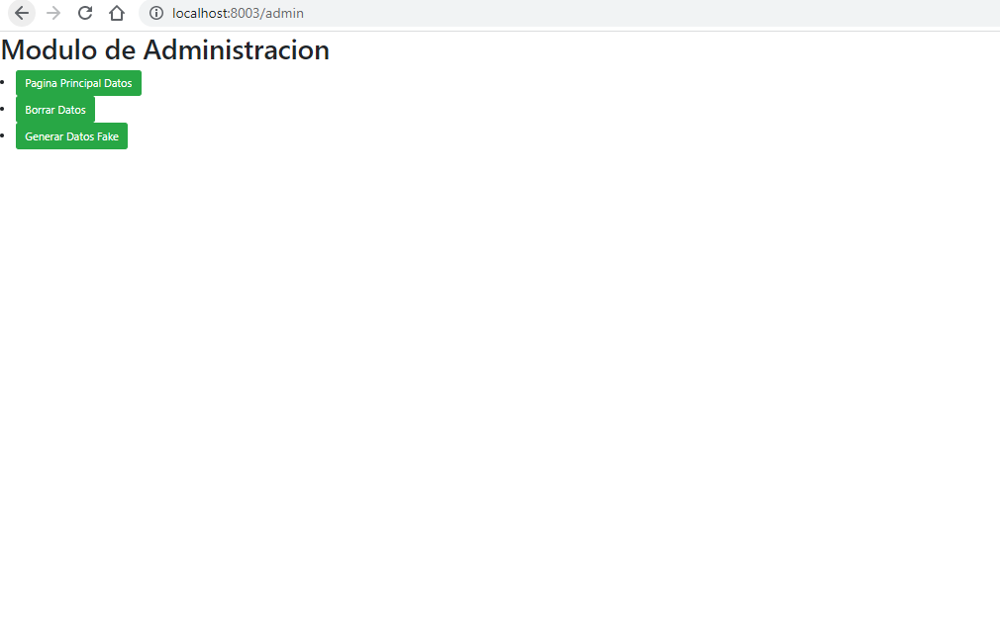

Realizado por :
    Jose alejandro calderon
    código 2016644
    Guilegar Mambuscay Orozco
    Código
    2116608

## Instalaciones necesarias
- Docker
https://www.docker.com/

# Correr proyecto

- docker-compose build
- docker-compose up

Puertos habilitados para los contenedores:

    - 8003 -> Interfaz web donde se muestran los registros que se encuentran en la bd .
    - 5001 -> Este servicio se encarga de gestionar todo lo que tenga que ver con apis.
    - 5000 -> Servicio que se encarga obtener , insertar , eliminar registros de la bd.

# Interfaz web

# Correr test
- Para correr los test el proyecto debe de estar corriendo
docker-compose -f docker-compose.yml exec -T faker-servicio pytest test/test_faker.py -s

# El gestor de depedencias que se usa es pip el cual es el encargado de instalar todos los paquetes necesarios para cada proyecto , incluso en los servicios de faker,web y api en el Dockerfile se corre RUN python3 -m pip install -r requirements.txt

# Verificador de codigo se encuentra en la carpeta .vscode en settings.json , se usa flake8